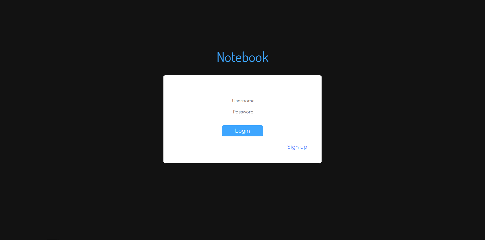

# Notebook

An app you can trust your secrets with.<br>
Try it out: https://securenotebook.pythonanywhere.com/<br>
This app uses AES-128 GCM to prevent anyone but you from accessing your notes.<br>

[]()
[]()
[](https://discord.gg/SMUaWmn)
[](https://www.paypal.me/Msheikh03)
<br><br>



## How does work?

### Register

1. Generates a 16-bytes **(128-bits)** AES key
2. Derives a master key from your password
3. Encrypts AES key using master key
4. Hashes your password
5. Saves hashed password to database
6. Saves encrypted AES key to database

### Login

1. Derives a master key from your password
2. Saves master key into your browser's session

### Encrypt data

1. Gets your master key from your session
2. Uses your master key to decrypt your AES key
3. Uses your decrypted AES key to encrypt your data

### Decrypt data

1. Gets your master key from your session
2. Uses your master key to decrypt your AES key
3. Uses your decrypted AES key to decrypt your data

### Notice:

**Your master key is only derivable from your plain-text password**<br>
**Your plain-text is only available when you are logging in**<br>
**Your master key is never saved into a database**<br>
**Your decrypted AES key is never saved**

### Warning:

**If you lost your password, then your notes will be lost as well**

# Usage

### Installation

```shell
$ > pip install -r requirements.txt
```

### Start

```shell
$ > python notebook.py
```

### Navigate to the following URL within your browser

```
http://localhost:5000
```
